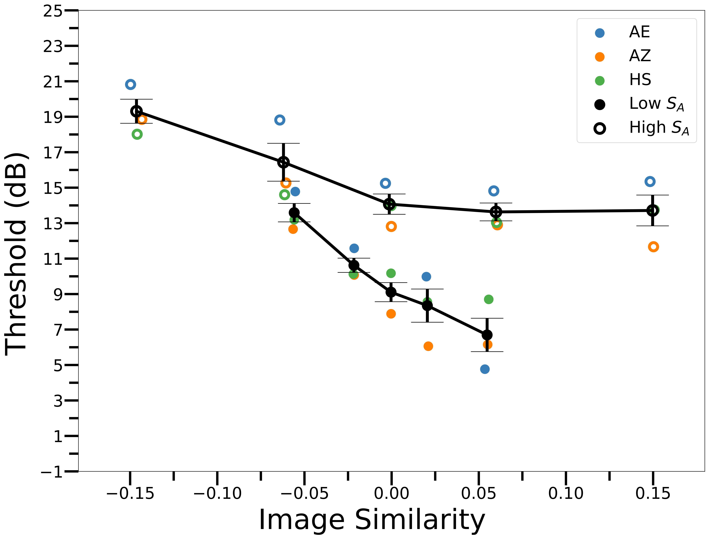

# Supraoptimal Visual Search with Heuristic Decision Rules

## Table of Contents

1. experiment: psychophysical data of human participants in the detection task blocked in phase similarity.
2. simulation: response pattern to phase of simple and complex cells.

## Function / Purpose

This repository is a summary of my research project under the supervision of Dr. Wilson Geisler. We discovered that due to the intrinsic position uncertainty of the human visual system, target is easier to be detected when its phase is more similar to that of the background.

## Reference
For more details of this project, welcome to read the corresponding peer-reviewed article:

[Zhang, A., Seemiller, E. S., \& Geisler, W. S. (2023). Phase-dependent asymmetry of pattern masking in natural images explained by intrinsic position uncertainty. Journal of Vision, 23(10), 16-16.](https://jov.arvojournals.org/article.aspx?articleid=2792868)

## Contact

Email: anqizhang@utexas.edu

LinkedIn: www.linkedin.com/in/anqi-work
